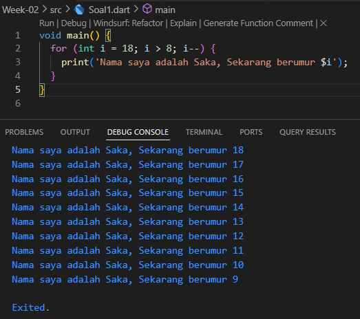
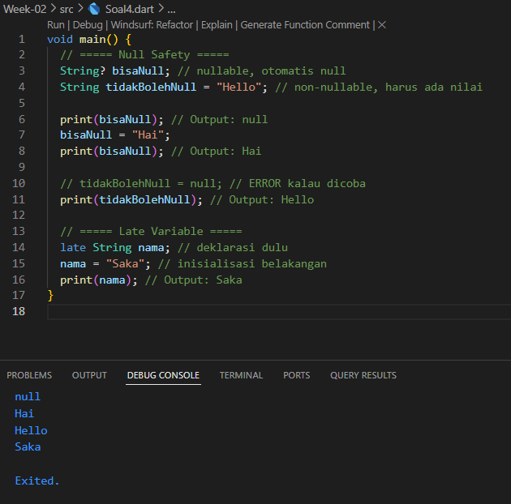

# Pemrograman Mobile

Nama : Saka Nabil

NIM : 2341720108

Kelas : TI-3G

# Tugas Praktikum Week 02

1. Modifikasilah kode pada baris 3 di VS Code atau Editor Code favorit Anda berikut ini agar mendapatkan keluaran (output) sesuai yang diminta!

   

2. Mengapa sangat penting untuk memahami bahasa pemrograman Dart sebelum kita menggunakan framework Flutter ? Jelaskan!

   Jawab : Karena Dart adalah dasar dari Flutter, sehingga tanpa menguasainya kita akan kesulitan memahami konsep widget, null safety, OOP, dan asynchronous yang menjadi inti dalam pengembangan aplikasi Flutter.

3. Rangkumlah materi dari codelab ini menjadi poin-poin penting yang dapat Anda gunakan untuk membantu proses pengembangan aplikasi mobile menggunakan framework Flutter.

   Rangkuman :

   - Dart itu fleksibel → bisa dipakai di banyak platform (web, mobile, desktop) karena mendukung kompilasi ke JavaScript maupun langsung ke kode native (ARM/x86).

   - Bikin kerja lebih gampang → ada banyak tools bawaan, plugin IDE, sampai ekosistem paket yang besar yang bikin ngoding lebih produktif.

   - Manajemen memori aman → ada garbage collection otomatis, jadi kita nggak perlu pusing urus data yang sudah nggak dipakai.

   - Tipe data rapi tapi fleksibel → kita bisa pakai type annotations biar kode lebih jelas, atau biarin Dart yang tebak tipe datanya lewat type inference.

   - Statically typed → bug atau kesalahan tipe data bisa ketahuan sejak proses kompilasi, bukan pas aplikasi jalan.

   - Operator umum tersedia → mulai dari +, -, \*, /, ~/, %, sampai negasi -expression semua sudah ada seperti di bahasa lain.

4. Buatlah penjelasan dan contoh eksekusi kode tentang perbedaan Null Safety dan Late variabel !

   Null Safety :

   - Tujuannya untuk mencegah null reference error (error karena mengakses null).

   - Variabel nullable ditandai dengan ?, misalnya String?.

   - Variabel non-nullable tidak bisa bernilai null, jadi harus diisi langsung.

   Dengan Null Safety, kita dipaksa lebih hati-hati saat menggunakan variabel, supaya tidak memanggil method/properti dari null.

   Late Variable :

   - late digunakan untuk variabel non-nullable yang tidak langsung diinisialisasi saat deklarasi, tapi nanti akan diisi sebelum dipakai.

   - Kalau diakses sebelum diinisialisasi → error runtime.

   - Biasanya dipakai untuk inisialisasi yang ditunda (misalnya menunggu data dari API)

   
