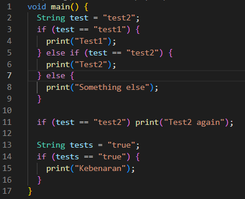
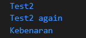
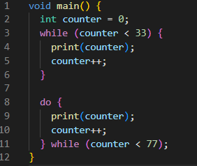
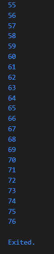
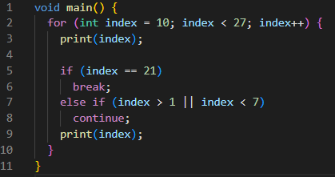
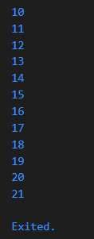
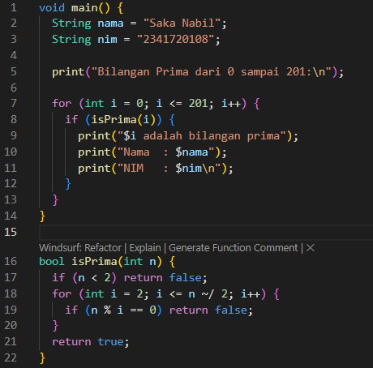
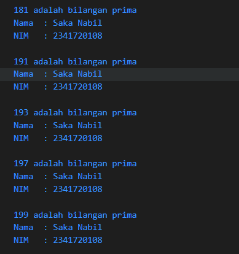

# Pemrograman Mobile

Nama : Saka Nabil

NIM : 2341720108

Kelas : TI-3G

# Pemrograman Dart Bagian 2 - Week 03

# Praktikum 1: Menerapkan Control Flows ("if/else")

## Langkah 1

#### String test = "test2";

#### if (test == "test1") {

#### print("Test1");

#### } else If (test == "test2") {

#### print("Test2");

#### } Else {

#### print("Something else");

#### }

#### if (test == "test2") print("Test2 again");

## Langkah 2

## Silakan coba eksekusi (Run) kode pada langkah 1 tersebut. Apa yang terjadi? Jelaskan!

    Jika di run kode akan error karena terdapat kesalahan penulisan pada kode, yaitu pada "else If" yang dimana huruf I pada If harusnya menggunakan huruf kecil sehingga menjadi "else if" serta pada "Else" yang seharusnya "else".

## Langkah 3

## Tambahkan kode program berikut, lalu coba eksekusi (Run) kode Anda. Apa yang terjadi ? Jika terjadi error, silakan perbaiki namun tetap menggunakan if/else.

#### String test = "true";

#### if (test) {

#### print("Kebenaran");

#### }

    Kode akan error karena data String belum dikonversi ke boolean. Untuk memperbaiki, tambahkan perintah "==" untuk mengkonversi nilai String ke boolean.

## Kode lengkap yang sudah benar

## Output

# Praktikum 2: Menerapkan Perulangan "while" dan "do-while"

## Langkah 1

## Ketik atau salin kode program berikut ke dalam fungsi main().

#### while (counter < 33) {

#### print(counter);

#### counter++;

#### }

## Langkah 2

## Silakan coba eksekusi (Run) kode pada langkah 1 tersebut. Apa yang terjadi? Jelaskan! Lalu perbaiki jika terjadi error.

    Kode akan error ketika di Run karena belum mendefinisikan variabel counter.

## Langkah 3

## Tambahkan kode program berikut, lalu coba eksekusi (Run) kode Anda. Apa yang terjadi ? Jika terjadi error, silakan perbaiki namun tetap menggunakan do-while.

#### do {

#### print(counter);

#### counter++;

#### } while (counter < 77);

    Tidak ada error ketika di Run karena perulangan while akan berhenti ketika nilai counter sama dengan 33 lalu dilanjukan dengan perulangan do-while hingga counter 76.

## Kode lengkap yang sudah benar

## Output

# Praktikum 3: Menerapkan Perulangan "while" dan "do-while"

## Langkah 1

## Ketik atau salin kode program berikut ke dalam fungsi main().

#### for (Index = 10; index < 27; index) {

#### print(Index);

#### }

## Langkah 2

## Silakan coba eksekusi (Run) kode pada langkah 1 tersebut. Apa yang terjadi? Jelaskan! Lalu perbaiki jika terjadi error.

    Kode akan error ketika di Run, karena variabel index belum di definisikan serta terdapat typo pada Index mestinya memiliki nama variabel yang sama untuk kondisi lainnya, Index diganti menjadi index serta perlu di definisikan menjadi int index.

## Langkah 3

## Tambahkan kode program berikut di dalam for-loop, lalu coba eksekusi (Run) kode Anda. Apa yang terjadi ? Jika terjadi error, silakan perbaiki namun tetap menggunakan for dan break-continue

    Kode akan error ketika di Run karena penulisan If dan Else If dengan huruf kapital serta typo pada Index.

## Kode lengkap yang sudah benar

## Output

# Tugas Praktikum

## 1. Silakan selesaikan Praktikum 1 sampai 3, lalu dokumentasikan berupa screenshot hasil pekerjaan beserta penjelasannya!

## Done

## 2. Buatlah sebuah program yang dapat menampilkan bilangan prima dari angka 0 sampai 201 menggunakan Dart. Ketika bilangan prima ditemukan, maka tampilkan nama lengkap dan NIM Anda.

## Kode Program

## Output

## 3. Kumpulkan berupa link commit repo GitHub pada tautan yang telah disediakan di grup Telegram!

## Done
