# Pemrograman Mobile

Nama : Saka Nabil

NIM : 2341720108

Kelas : TI-3G

# Pengantar Bahasa Pemrograman Dart - Bagian 3 - Week 04

# Praktikum 1: Eksperimen Tipe Data List

## Langkah 1

#### var list = [1, 2, 3];

#### assert(list.length == 3);

#### assert(list[1] == 2);

#### print(list.length);

#### print(list[1]);

#### list[1] = 1;

#### assert(list[1] == 1);

#### print(list[1]);

## Langkah 2

## Silakan coba eksekusi (Run) kode pada langkah 1 tersebut. Apa yang terjadi? Jelaskan!

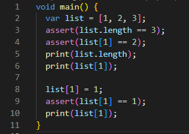

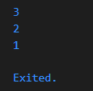

    Potongan kode ini membuat sebuah list dengan tiga elemen (1, 2, dan 3) dan memeriksa panjang list serta nilai elemen kedua. Kemudian, program mencetak panjang list dan nilai elemen kedua. Setelah itu, nilai elemen kedua diubah menjadi 1 dan diperiksa kembali untuk memastikan perubahan. Hasil keluaran yang diharapkan adalah panjang list (3), nilai awal elemen kedua (2), dan nilai elemen kedua setelah diubah (1). Pernyataan assert digunakan untuk memastikan bahwa kondisi yang diberikan benar selama eksekusi program.

## Langkah 3

## Ubah kode pada langkah 1 menjadi variabel final yang mempunyai index = 5 dengan default value = null. Isilah nama dan NIM Anda pada elemen index ke-1 dan ke-2. Lalu print dan capture hasilnya.

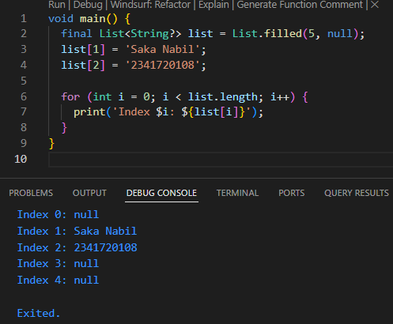

# Praktikum 2: Eksperimen Tipe Data Set

## Langkah 1

## Ketik atau salin kode program berikut ke dalam fungsi main().

#### var halogens = {'fluorine', 'chlorine', 'bromine', 'iodine', 'astatine'};

#### print(halogens);

## Langkah 2

## Silakan coba eksekusi (Run) kode pada langkah 1 tersebut. Apa yang terjadi? Jelaskan! Lalu perbaiki jika terjadi error.

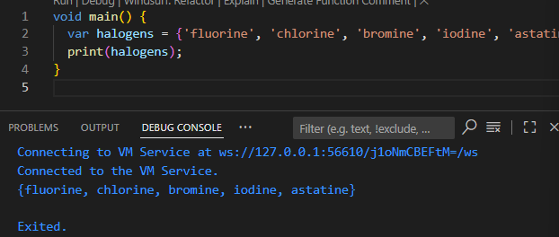

    Kode tersebut membuat sebuah daftar (list) yang berisi elemen-elemen yang mewakili unsur-unsur halogen dalam tabel periodik.

## Langkah 3

## Tambahkan kode program berikut, lalu coba eksekusi (Run) kode Anda.

#### var names1 = <String>{};

#### Set<String> names2 = {}; // This works, too.

#### var names3 = {}; // Creates a map, not a set.

#### print(names1);

#### print(names2);

#### print(names3);

## Apa yang terjadi ? Jika terjadi error, silakan perbaiki namun tetap menggunakan ketiga variabel tersebut. Tambahkan elemen nama dan NIM Anda pada kedua variabel Set tersebut dengan dua fungsi berbeda yaitu .add() dan .addAll(). Untuk variabel Map dihapus, nanti kita coba di praktikum selanjutnya.

    Kode tersebut mencoba membuat tiga koleksi data yang berbeda, namun hasilnya tidak seragam. Dua variabel pertama, names1 dan names2, berhasil membuat set kosong yang berisi data bertipe String. Sedangkan variabel names3 malah membuat map kosong (yang menyimpan pasangan kunci-nilai), bukan sebuah set. Ini terjadi karena dalam bahasa pemrograman Dart, kurung kurawal {} tanpa informasi tipe yang jelas akan secara otomatis dianggap sebagai map.

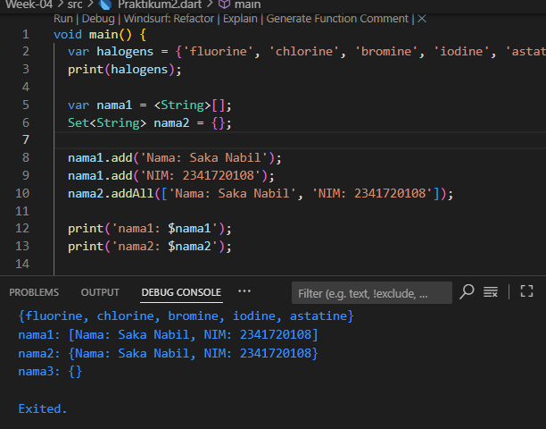

# Praktikum 3: Eksperimen Tipe Data Maps

## Langkah 1

## Ketik atau salin kode program berikut ke dalam fungsi main().

#### var gifts = {

#### // Key: Value

#### 'first': 'partridge',

#### 'second': 'turtledoves',

#### 'fifth': 1

#### };

#### var nobleGases = {

#### 2: 'helium',

#### 10: 'neon',

#### 18: 2,

#### };

#### print(gifts);

#### print(nobleGases);

## Langkah 2

## Silakan coba eksekusi (Run) kode pada langkah 1 tersebut. Apa yang terjadi? Jelaskan! Lalu perbaiki jika terjadi error.

    Kode tersebut menggunakan map dalam bahasa pemrograman Dart, yang berfungsi untuk menyimpan data dalam bentuk pasangan kunci-nilai.

## Langkah 3

## Tambahkan kode program berikut, lalu coba eksekusi (Run) kode Anda

#### var mhs1 = Map<String, String>();

#### gifts['first'] = 'partridge';

#### gifts['second'] = 'turtledoves';

#### gifts['fifth'] = 'golden rings';

#### var mhs2 = Map<int, String>();

#### nobleGases[2] = 'helium';

#### nobleGases[10] = 'neon';

#### nobleGases[18] = 'argon';

## Tambahkan elemen nama dan NIM Anda pada tiap variabel di atas (gifts, nobleGases, mhs1, dan mhs2). Dokumentasikan hasilnya dan buat laporannya!

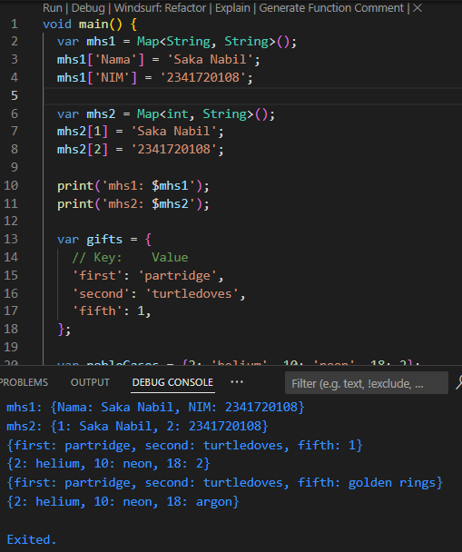

# Praktikum 4: Eksperimen Tipe Data List: Spread dan Control-flow Operators

## Langkah 1

## Ketik atau salin kode program berikut ke dalam fungsi main()

#### var list = [1, 2, 3];

#### var list2 = [0, ...list];

#### print(list1);

#### print(list2);

#### print(list2.length);

## Langkah 2

## Silakan coba eksekusi (Run) kode pada langkah 1 tersebut. Apa yang terjadi? Jelaskan! Lalu perbaiki jika terjadi error.

    Kode tersebut eror karena mencoba mencetak variabel list1 yang belum dideklarasikan atau tidak ada.

## Langkah 3

## Tambahkan kode program berikut, lalu coba eksekusi (Run) kode Anda.

#### list1 = [1, 2, null];

#### print(list1);

#### var list3 = [0, ...?list1];

#### print(list3.length);

## Tambahkan variabel list berisi NIM Anda menggunakan Spread Operators. Dokumentasikan hasilnya dan buat laporannya!

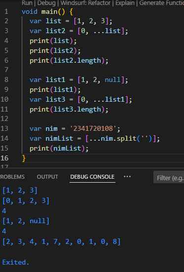

## Langkah 4

## Tambahkan kode program berikut, lalu coba eksekusi (Run) kode Anda.

#### var nav = ['Home', 'Furniture', 'Plants', if (promoActive) 'Outlet'];

#### print(nav);

## Apa yang terjadi ? Jika terjadi error, silakan perbaiki. Tunjukkan hasilnya jika variabel promoActive ketika true dan false.

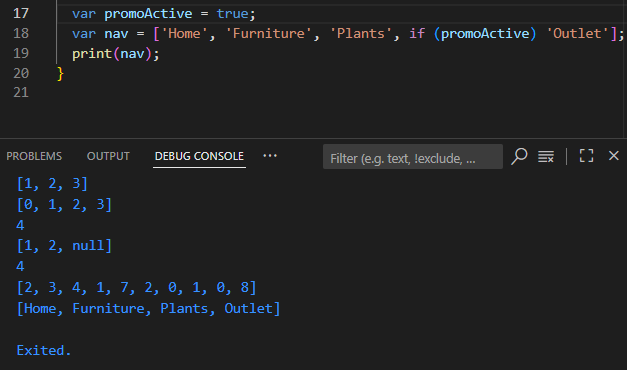

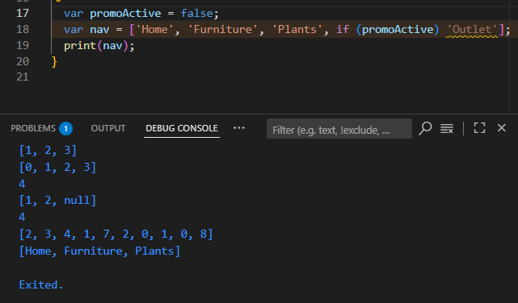

## Langkah 5

## Tambahkan kode program berikut, lalu coba eksekusi (Run) kode Anda.

#### var nav2 = ['Home', 'Furniture', 'Plants', if (login case 'Manager') 'Inventory'];

#### print(nav2);

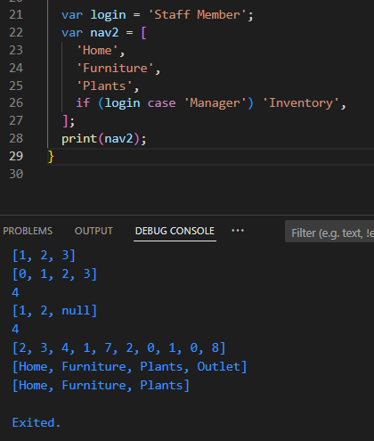

## Langkah 6

## Tambahkan kode program berikut, lalu coba eksekusi (Run) kode Anda.

#### var listOfInts = [1, 2, 3];

#### var listOfStrings = ['#0', for (var i in listOfInts) '#$i'];

#### assert(listOfStrings[1] == '#1');

#### print(listOfStrings);

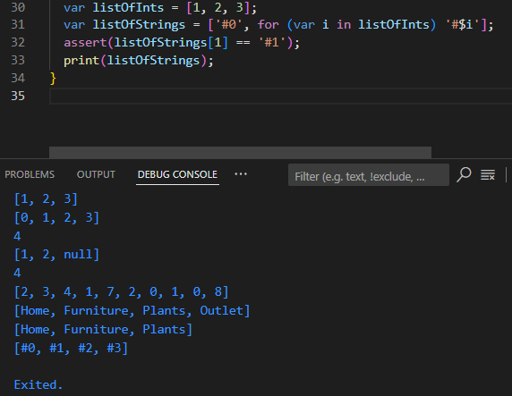

# Praktikum 5: Eksperimen Tipe Data Records

## Langkah 1

## Ketik atau salin kode program berikut ke dalam fungsi main()

#### var record = ('first', a: 2, b: true, 'last');

#### print(record)

## Langkah 2

## Silakan coba eksekusi (Run) kode pada langkah 1 tersebut. Apa yang terjadi? Jelaskan! Lalu perbaiki jika terjadi error.

    Kode diatas error karena tidak diberi ";" diakhir kode program.

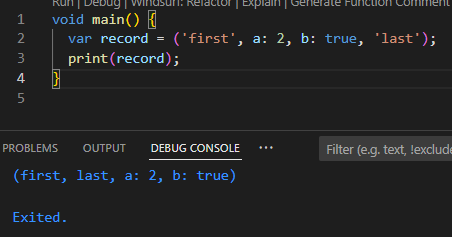

## Langkah 3

## Tambahkan kode program berikut di luar scope void main(), lalu coba eksekusi (Run) kode Anda.

#### (int, int) tukar((int, int) record) {

#### var (a, b) = record;

#### return (b, a);

#### }

## Apa yang terjadi ? Jika terjadi error, silakan perbaiki. Gunakan fungsi tukar() di dalam main() sehingga tampak jelas proses pertukaran value field di dalam Records.

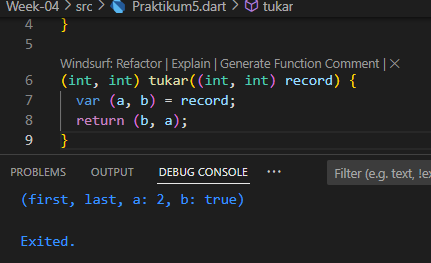

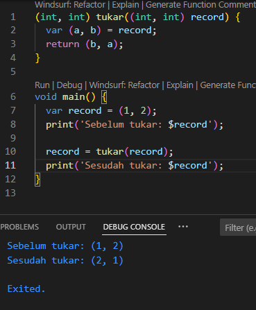

## Langkah 4

## Tambahkan kode program berikut di dalam scope void main(), lalu coba eksekusi (Run) kode Anda.

#### // Record type annotation in a variable declaration:

#### (String, int) mahasiswa;

#### print(mahasiswa);

## Apa yang terjadi ? Jika terjadi error, silakan perbaiki. Inisialisasi field nama dan NIM Anda pada variabel record mahasiswa di atas. Dokumentasikan hasilnya dan buat laporannya!

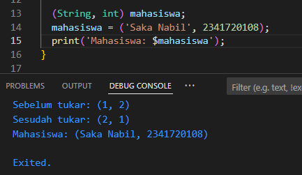

## Langkah 5

## Tambahkan kode program berikut di dalam scope void main(), lalu coba eksekusi (Run) kode Anda.

#### var mahasiswa2 = ('first', a: 2, b: true, 'last');

#### print(mahasiswa2.$1); // Prints 'first'

#### print(mahasiswa2.a); // Prints 2

#### print(mahasiswa2.b); // Prints true

#### print(mahasiswa2.$2); // Prints 'last'

## Apa yang terjadi ? Jika terjadi error, silakan perbaiki. Gantilah salah satu isi record dengan nama dan NIM Anda, lalu dokumentasikan hasilnya dan buat laporannya!

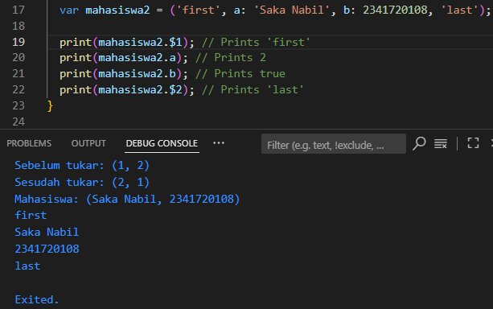

# Tugas Praktikum

## 1. Silakan selesaikan Praktikum 1 sampai 5, lalu dokumentasikan berupa screenshot hasil pekerjaan Anda beserta penjelasannya!

    Done.

## 2. Jelaskan yang dimaksud Functions dalam bahasa Dart!

    Fungsi (function) adalah blok kode yang dapat digunakan kembali. Fungsinya untuk menyelesaikan tugas tertentu, menerima masukan (parameter), dan bisa mengembalikan nilai. Dengan fungsi, kode jadi lebih rapi dan mudah diatur.

## 3. Jelaskan jenis-jenis parameter di Functions beserta contoh sintaksnya!

    Di Dart, ada beberapa jenis parameter yang bisa kita gunakan:

    1. Required Positional Parameters: Parameter yang wajib diisi dan urutannya harus sesuai.

```dart
void printName(String firstName, String lastName) {
    print('Nama lengkap: $firstName $lastName');
}
// Contoh penggunaan: printName('Saka', 'Nabil');
```

    2. Optional Positional Parameters: Parameter opsional yang diletakkan di dalam kurung siku [].

```dart
void printName(String firstName, [String? middleName, String? lastName]) {
    print('Nama lengkap: $firstName $middleName $lastName');
}
// Contoh penggunaan: printName('Saka'); atau printName('Saka', 'Nabil');
```

    3. Named Parameters: Parameter yang didefinisikan dengan kurung kurawal {} dan bisa diisi dengan urutan acak. Kita bisa menambahkan kata kunci required kalau parameternya wajib diisi.

```dart
void printName({String? firstName, String? lastName}) {
    print('Nama lengkap: $firstName $lastName');
}
// Contoh penggunaan: printName(lastName: 'Nabil', firstName: 'Saka');
```

## 4. Jelaskan maksud Functions sebagai first-class objects beserta contoh sintaknya!

    Di Dart, fungsi dianggap sebagai objek. Artinya, fungsi bisa disimpan di dalam variabel, dilewatkan sebagai argumen ke fungsi lain, atau dikembalikan sebagai nilai dari fungsi lain. Ini memberikan fleksibilitas tinggi dalam menulis kode.

```dart
void main() {
  // Menyimpan fungsi ke dalam variabel
  var func = add;
  print(func(2, 3)); // Output: 5

  // Melewatkan fungsi sebagai argumen
  calculate(func, 5, 5); // Output: 10
}

void calculate(Function operation, int x, int y) {
  print(operation(x, y));
}
```

## 5. Apa itu Anonymous Functions? Jelaskan dan berikan contohnya!

    Anonymous function atau fungsi tanpa nama, adalah fungsi yang tidak punya nama. Biasanya digunakan untuk tugas singkat atau sebagai argumen untuk fungsi lain, seperti saat menggunakan forEach pada list.

```dart
var buah = ['apel', 'pisang', 'jeruk'];
buah.forEach((buah) {
  print(buah);
});

// Contoh lain:
var multiply = (int a, int b) {
  return a * b;
};
print(multiply(3, 4)); // Output: 12
```

## 6. Jelaskan perbedaan Lexical scope dan Lexical closures! Berikan contohnya!

    - Lexical Scope: Aturan ini menentukan di mana sebuah variabel bisa diakses. Variabel di dalam sebuah fungsi hanya bisa diakses dari dalam fungsi itu atau fungsi lain di dalamnya.

```dart
var globalVar = 'Hello';
void outerFunction() {
  var outerVar = 'World';
  void innerFunction() {
    // innerFunction bisa mengakses outerVar dan globalVar
    print('$globalVar $outerVar');
  }
  innerFunction();
}
```

    - Lexical Closures: Closure adalah fungsi yang bisa mengakses variabel dari scope di atasnya, bahkan setelah scope tersebut selesai dieksekusi. Closure "mengingat" variabel di sekitarnya.

```dart
Function makeAdder(int addBy) {
  return (int i) => addBy + i;
}

void main() {
  var add2 = makeAdder(2);
  print(add2(3)); // Output: 5. add2 mengingat nilai addBy=2.
}
```

## 7. Jelaskan dengan contoh cara membuat return multiple value di Functions!

    - Menggunakan List atau Map:

```dart
List<dynamic> getPerson() {
  String name = 'Budi';
  int age = 25;
  return [name, age];
}

void main() {
  var data = getPerson();
  print('Nama: ${data[0]}, Umur: ${data[1]}'); // Output: Nama: Budi, Umur: 25
}
```

    - Menggunakan Records (mulai Dart 3.0): Ini cara paling baru dan direkomendasikan.

```dart
(String, int) getPerson() {
  String name = 'Budi';
  int age = 25;
  return (name, age);
}

void main() {
  var person = getPerson();
  print('Nama: ${person.$1}, Umur: ${person.$2}'); // Output: Nama: Budi, Umur: 25
}
```
