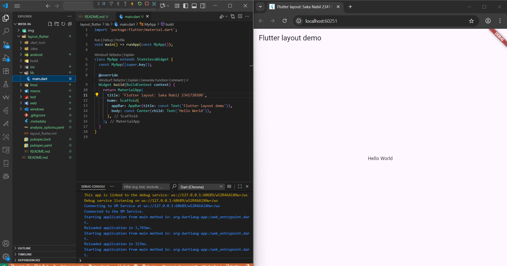
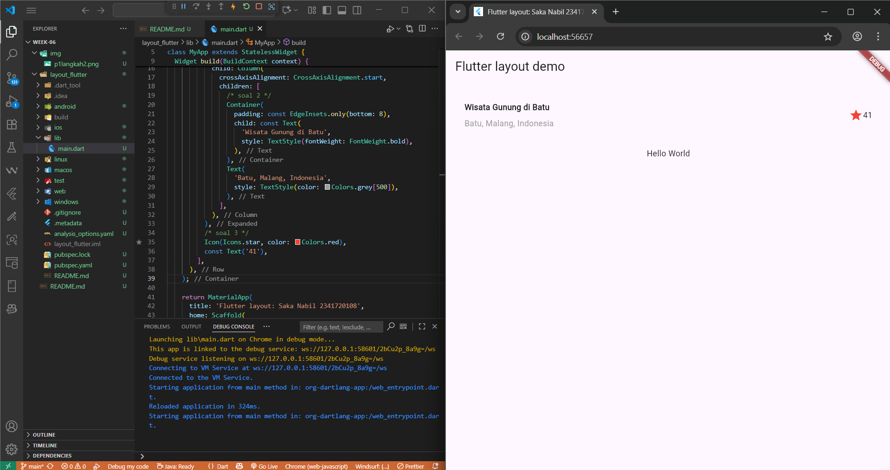
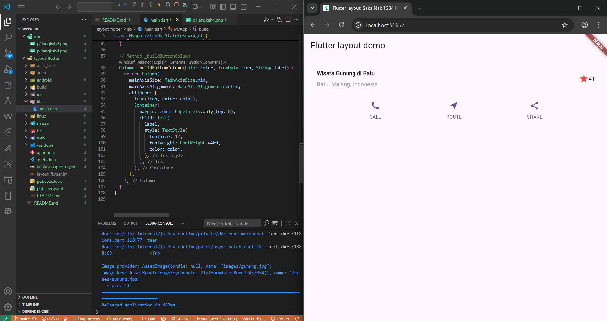
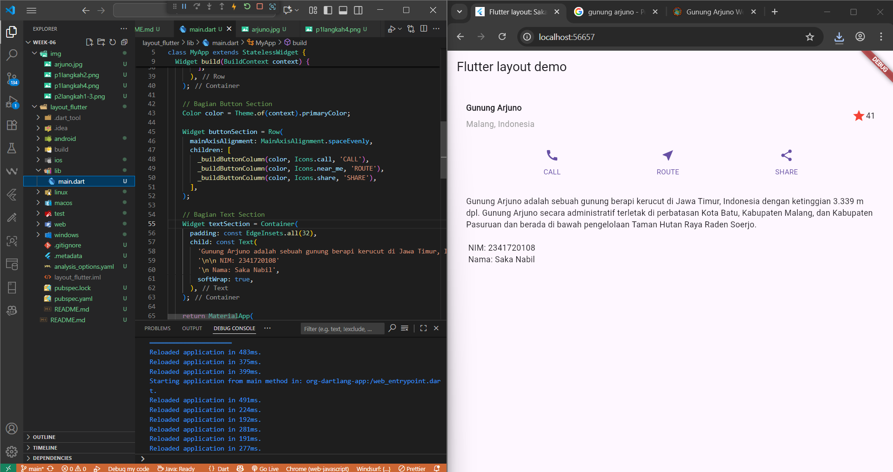
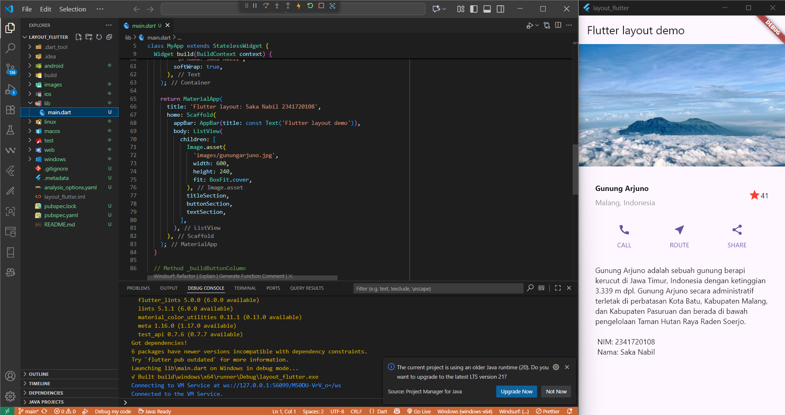
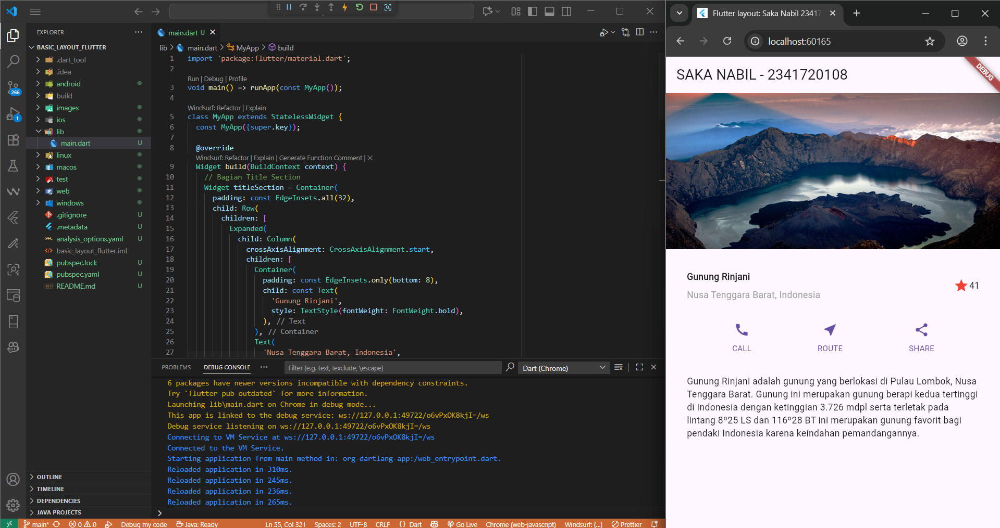

# Pemrograman Mobile

Nama : Saka Nabil

NIM : 2341720108

Kelas : TI-3G

# Layout dan Navigasi - Week 06

# Praktikum 1: Membangun Layout di Flutter

## Langkah 2: Buka file lib/main.dart

### Buka file main.dart lalu ganti dengan kode berikut. Isi nama dan NIM Anda di text title.

```dart
import 'package:flutter/material.dart';

void main() => runApp(const MyApp());

class MyApp extends StatelessWidget {
  const MyApp({super.key});

  @override
  Widget build(BuildContext context) {
    return MaterialApp(
      title: 'Flutter layout: Nama dan NIM Anda',
      home: Scaffold(
        appBar: AppBar(
          title: const Text('Flutter layout demo'),
        ),
        body: const Center(
          child: Text('Hello World'),
        ),
      ),
    );
  }
}
```



## Langkah 4: Implementasi title row

### Pertama, Anda akan membuat kolom bagian kiri pada judul. Tambahkan kode berikut di bagian atas metode build() di dalam kelas MyApp:

```dart
Widget titleSection = Container(
  padding: const EdgeInsets.all(...),
  child: Row(
    children: [
      Expanded(
        /* soal 1*/
        child: Column(
          crossAxisAlignment: ...,
          children: [
            /* soal 2*/
            Container(
              padding: const EdgeInsets.only(bottom: ...),
              child: const Text(
                'Wisata Gunung di Batu',
                style: TextStyle(
                  fontWeight: FontWeight.bold,
                ),
              ),
            ),
            Text(
              'Batu, Malang, Indonesia',
              style: TextStyle(...),
            ),
          ],
        ),
      ),
      /* soal 3*/
      Icon(
       ...,
        color: ...,
      ),
      const Text(...),
    ],
  ),
);
```

### /_ soal 1 _/ Letakkan widget Column di dalam widget Expanded agar menyesuaikan ruang yang tersisa di dalam widget Row. Tambahkan properti crossAxisAlignment ke CrossAxisAlignment.start sehingga posisi kolom berada di awal baris.

### /_ soal 2 _/ Letakkan baris pertama teks di dalam Container sehingga memungkinkan Anda untuk menambahkan padding = 8. Teks ‘Batu, Malang, Indonesia' di dalam Column, set warna menjadi abu-abu.

### /_ soal 3 _/ Dua item terakhir di baris judul adalah ikon bintang, set dengan warna merah, dan teks "41". Seluruh baris ada di dalam Container dan beri padding di sepanjang setiap tepinya sebesar 32 piksel. Kemudian ganti isi body text ‘Hello World' dengan variabel titleSection seperti berikut:



# Praktikum 2: Implementasi button row

## Langkah 1: Buat method Column \_buildButtonColumn

```dart
class MyApp extends StatelessWidget {
  const MyApp({super.key});

  @override
  Widget build(BuildContext context) {
    // ···
  }

  Column _buildButtonColumn(Color color, IconData icon, String label) {
    return Column(
      mainAxisSize: MainAxisSize.min,
      mainAxisAlignment: MainAxisAlignment.center,
      children: [
        Icon(icon, color: color),
        Container(
          margin: const EdgeInsets.only(top: 8),
          child: Text(
            label,
            style: TextStyle(
              fontSize: 12,
              fontWeight: FontWeight.w400,
              color: color,
            ),
          ),
        ),
      ],
    );
  }
}
```

## Langkah 2: Buat widget buttonSection

```dart
Color color = Theme.of(context).primaryColor;

Widget buttonSection = Row(
  mainAxisAlignment: MainAxisAlignment.spaceEvenly,
  children: [
    _buildButtonColumn(color, Icons.call, 'CALL'),
    _buildButtonColumn(color, Icons.near_me, 'ROUTE'),
    _buildButtonColumn(color, Icons.share, 'SHARE'),
  ],
);
```

## Langkah 3: Tambah button section ke body



# Praktikum 3: Implementasi text section

## Langkah 1: Buat widget textSection

```dart
Widget textSection = Container(
  padding: const EdgeInsets.all(32),
  child: const Text(
    'Carilah teks di internet yang sesuai '
    'dengan foto atau tempat wisata yang ingin '
    'Anda tampilkan. '
    'Tambahkan nama dan NIM Anda sebagai '
    'identitas hasil pekerjaan Anda. '
    'Selamat mengerjakan 🙂.',
    softWrap: true,
  ),
);
```

## Langkah 2: Tambahkan variabel text section ke body



# Praktikum 4: Implementasi image section

## Langkah 1: Siapkan aset gambar

### Anda dapat mencari gambar di internet yang ingin ditampilkan. Buatlah folder images di root project layout_flutter. Masukkan file gambar tersebut ke folder images, lalu set nama file tersebut ke file pubspec.yaml.

## Langkah 2: Tambahkan gambar ke body

### Tambahkan aset gambar ke dalam body

## Langkah 3: Terakhir, ubah menjadi ListView

### Pada langkah terakhir ini, atur semua elemen dalam ListView, bukan Column, karena ListView mendukung scroll yang dinamis saat aplikasi dijalankan pada perangkat yang resolusinya lebih kecil.



# Tugas Praktikum 1

## 1. Selesaikan Praktikum 1 sampai 4, lalu dokumentasikan dan push ke repository Anda berupa screenshot setiap hasil pekerjaan beserta penjelasannya di file README.md!

    Done.

## 2. Silakan implementasikan di project baru "basic_layout_flutter" dengan mengakses sumber ini: https://docs.flutter.dev/codelabs/layout-basics

## basic_layout_flutter:



## 3. Kumpulkan link commit repository GitHub Anda kepada dosen yang telah disepakati!

    Done.

# Praktikum 5: Membangun Navigasi di Flutter

## Langkah 2: Mendefinisikan Route

### Buatlah dua buah file dart dengan nama home_page.dart dan item_page.dart pada folder pages. Untuk masing-masing file, deklarasikan class HomePage pada file home_page.dart dan ItemPage pada item_page.dart. Turunkan class dari StatelessWidget.

## Langkah 3: Lengkapi Kode di main.dart

### Setelah kedua halaman telah dibuat dan didefinisikan, bukalah file main.dart. Pada langkah ini anda akan mendefinisikan Route untuk kedua halaman tersebut. Definisi penamaan route harus bersifat unique. Halaman HomePage didefinisikan sebagai /. Dan halaman ItemPage didefinisikan sebagai /item. Untuk mendefinisikan halaman awal, anda dapat menggunakan named argument initialRoute.

## Langkah 4: Membuat data model

### Sebelum melakukan perpindahan halaman dari HomePage ke ItemPage, dibutuhkan proses pemodelan data. Pada desain mockup, dibutuhkan dua informasi yaitu nama dan harga. Untuk menangani hal ini, buatlah sebuah file dengan nama item.dart dan letakkan pada folder models. Pada file ini didefinisikan pemodelan data yang dibutuhkan.

## Langkah 5: Lengkapi kode di class HomePage

### Pada halaman HomePage terdapat ListView widget. Sumber data ListView diambil dari model List dari object Item.

## Langkah 6: Membuat ListView dan itemBuilder

### Untuk menampilkan ListView pada praktikum ini digunakan itemBuilder. Data diambil dari definisi model yang telah dibuat sebelumnya. Untuk menunjukkan batas data satu dan berikutnya digunakan widget Card. Kode yang telah umum pada bagian ini tidak ditampilkan.

## Langkah 7: Menambahkan aksi pada ListView

### Item pada ListView saat ini ketika ditekan masih belum memberikan aksi tertentu. Untuk menambahkan aksi pada ListView dapat digunakan widget InkWell atau GestureDetector. Perbedaan utamanya InkWell merupakan material widget yang memberikan efek ketika ditekan. Sedangkan GestureDetector bersifat umum dan bisa juga digunakan untuk gesture lain selain sentuhan. Pada praktikum ini akan digunakan widget InkWell.

# Tugas Praktikum 2

## 1. Untuk melakukan pengiriman data ke halaman berikutnya, cukup menambahkan informasi arguments pada penggunaan Navigator. Perbarui kode pada bagian Navigator menjadi seperti berikut.

```dart
Navigator.pushNamed(context, '/item', arguments: item);
```

## 2. Pembacaan nilai yang dikirimkan pada halaman sebelumnya dapat dilakukan menggunakan ModalRoute. Tambahkan kode berikut pada blok fungsi build dalam halaman ItemPage. Setelah nilai didapatkan, anda dapat menggunakannya seperti penggunaan variabel pada umumnya. (https://docs.flutter.dev/cookbook/navigation/navigate-with-arguments)

```dart
final itemArgs = ModalRoute.of(context)!.settings.arguments as Item;
```

## 3. Pada hasil akhir dari aplikasi belanja yang telah anda selesaikan, tambahkan atribut foto produk, stok, dan rating. Ubahlah tampilan menjadi GridView seperti di aplikasi marketplace pada umumnya.

## 4. Silakan implementasikan Hero widget pada aplikasi belanja Anda dengan mempelajari dari sumber ini: https://docs.flutter.dev/cookbook/navigation/hero-animations

## 5. Sesuaikan dan modifikasi tampilan sehingga menjadi aplikasi yang menarik. Selain itu, pecah widget menjadi kode yang lebih kecil. Tambahkan Nama dan NIM di footer aplikasi belanja Anda.

## 6. Selesaikan Praktikum 5: Navigasi dan Rute tersebut. Cobalah modifikasi menggunakan plugin go_router, lalu dokumentasikan dan push ke repository Anda berupa screenshot setiap hasil pekerjaan beserta penjelasannya di file README.md. Kumpulkan link commit repository GitHub Anda kepada dosen yang telah disepakati!

## Hasil project belanja dari Praktikum 5 - Tugas


