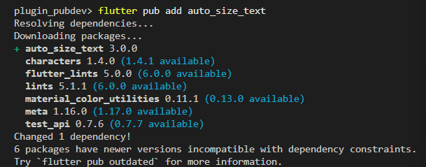
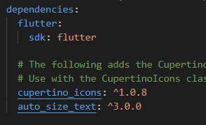
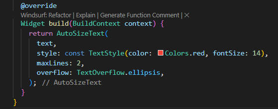
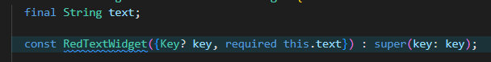
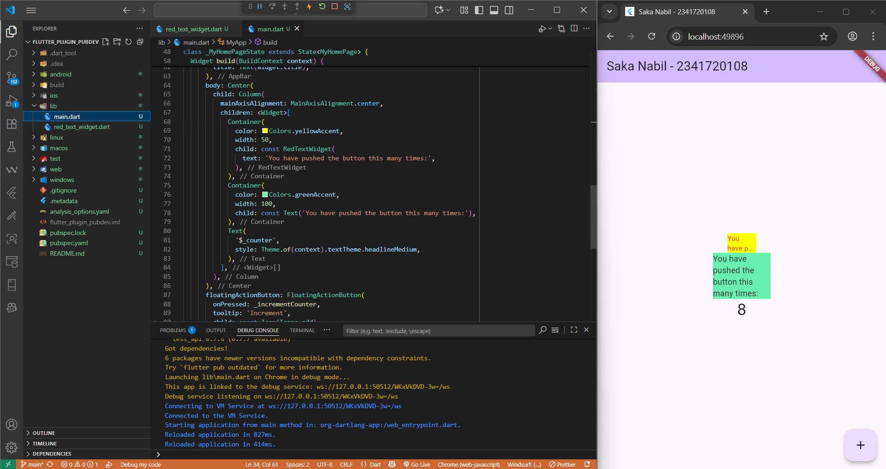

# Pemrograman Mobile

Nama : Saka Nabil

NIM : 2341720108

Kelas : TI-3G

# Manajemen Plugin - Week 07

# Praktikum Menerapkan Plugin di Project Flutter

## Langkah 1: Buat Project Baru

### Buatlah sebuah project flutter baru dengan nama flutter_plugin_pubdev. Lalu jadikan repository di GitHub Anda dengan nama flutter_plugin_pubdev.

## Langkah 2: Menambahkan Plugin

### Tambahkan plugin auto_size_text menggunakan perintah berikut di terminal

```
    flutter pub add auto_size_text
```




## Langkah 3: Buat file red_text_widget.dart

### Buat file baru bernama red_text_widget.dart di dalam folder lib lalu isi kode seperti berikut

```dart
import 'package:flutter/material.dart';

class RedTextWidget extends StatelessWidget {
  const RedTextWidget({Key? key}) : super(key: key);

  @override
  Widget build(BuildContext context) {
    return Container();
  }
}
```

## Langkah 4: Tambah Widget AutoSizeText

```dart
return AutoSizeText(
      text,
      style: const TextStyle(color: Colors.red, fontSize: 14),
      maxLines: 2,
      overflow: TextOverflow.ellipsis,
);
```



## Langkah 5: Buat Variabel text dan parameter di constructor

### Tambahkan variabel text dan parameter di constructor seperti berikut.

```dart
final String text;

const RedTextWidget({Key? key, required this.text}) : super(key: key);
```



## Langkah 6: Tambahkan widget di main.dart

### Buka file main.dart lalu tambahkan di dalam children: pada class \_MyHomePageState

```dart
Container(
   color: Colors.yellowAccent,
   width: 50,
   child: const RedTextWidget(
             text: 'You have pushed the button this many times:',
          ),
),
Container(
    color: Colors.greenAccent,
    width: 100,
    child: const Text(
           'You have pushed the button this many times:',
          ),
),
```

### Run aplikasi tersebut dengan tekan F5, maka hasilnya akan seperti berikut.



# Tugas Praktikum

## 1. Selesaikan Praktikum tersebut, lalu dokumentasikan dan push ke repository Anda berupa screenshot hasil pekerjaan beserta penjelasannya di file README.md!

    Done.

## 2. Jelaskan maksud dari langkah 2 pada praktikum tersebut!

### Jawab : Perintah flutter pub add digunakan untuk menambahkan plugin tertentu ke dalam project, pada langkah 2 perintahnya adalah flutter pub add auto_size_text yang berarti digunakan untuk menambahkan plugin auto_size_text yang digunakan dalam project praktikum.

## 3. Jelaskan maksud dari langkah 5 pada praktikum tersebut!

### Jawab : Menambahkan variabel text dan parameter di constructor bertujuan aga widged RedTextWidget dapat menerima text dari luar sebagai input, dan menyimpannya ke dalam variabel text, kemudian menampilkannya di layar.

## 4. Pada langkah 6 terdapat dua widget yang ditambahkan, jelaskan fungsi dan perbedaannya!

### Jawab : Fungsi utama kedua widget tersebut adalah digunakan untuk menampilkan teks dalam Container dengan perbedaan yaitu RedTextWidget menampilkan teks berwarna merah dan dapat menyesuaikan ukuran otomatis agar muat dalam ruang yang sempit sedangkan Text biasa hanya menampilkan teks standar tanpa penyesuaian otomatis dan dapat terpotong jika wadah terlalu sempit.

## 5. Jelaskan maksud dari tiap parameter yang ada di dalam plugin auto_size_text berdasarkan tautan pada dokumentasi ini !

### Jawab :

### key

### Mengontrol bagaimana satu widget menggantikan widget lain di dalam pohon widget (widget tree).

### textKey

### Menetapkan key untuk widget Text yang dihasilkan.

### style

### Jika tidak bernilai null, menentukan gaya teks (warna, ukuran huruf, ketebalan, dan sebagainya) yang akan digunakan.

### minFontSize

### Ukuran teks minimum yang digunakan saat penyesuaian otomatis ukuran teks dilakukan. Diabaikan jika presetFontSizes digunakan.

### maxFontSize

### Ukuran teks maksimum yang digunakan saat penyesuaian otomatis ukuran teks dilakukan. Diabaikan jika presetFontSizes digunakan.

### stepGranularity

### Langkah perubahan ukuran huruf saat menyesuaikan teks dengan batas tampilan yang ada.

### presetFontSizes

### Menentukan ukuran huruf yang telah didefinisikan sebelumnya. Penting: daftar ukuran harus diurutkan dari besar ke kecil (descending order).

### group

### Menyinkronkan ukuran beberapa AutoSizeText agar memiliki ukuran huruf yang sama.

### textAlign

### Menentukan bagaimana teks disejajarkan secara horizontal (misalnya: kiri, kanan, tengah).

### textDirection

### Menentukan arah penulisan teks (misalnya: dari kiri ke kanan atau kanan ke kiri). Ini memengaruhi interpretasi nilai seperti TextAlign.start dan TextAlign.end.

### locale

### Digunakan untuk memilih font ketika karakter Unicode yang sama dapat ditampilkan secara berbeda tergantung pada lokalnya.

### softWrap

### Menentukan apakah teks boleh terpotong pada batas baris lembut (soft line breaks).

### wrapWords

### Menentukan apakah kata yang tidak muat dalam satu baris boleh dibungkus ke baris berikutnya. Nilai default: true (agar berperilaku seperti Text).

### overflow

### Menentukan bagaimana teks yang melebihi batas tampilan ditangani (misalnya: dipotong, diberi elipsis, dan sebagainya).

### overflowReplacement

### Jika teks melebihi batas dan tidak muat, widget ini akan ditampilkan sebagai pengganti.

### textScaleFactor

### Jumlah piksel font untuk setiap piksel logis. Juga memengaruhi minFontSize, maxFontSize, dan presetFontSizes.

### maxLines

### Jumlah maksimum baris yang dapat ditampilkan oleh teks.

### semanticsLabel

### Label alternatif untuk kebutuhan aksesibilitas (misalnya untuk pembaca layar).

## 6. Kumpulkan laporan praktikum Anda berupa link repository GitHub kepada dosen!

    Done.
