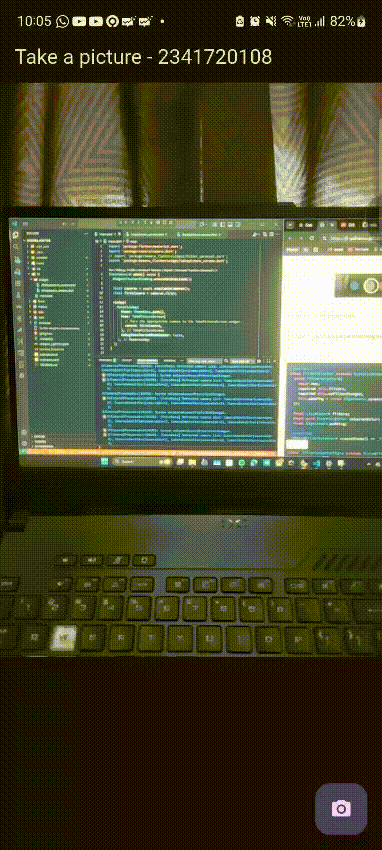
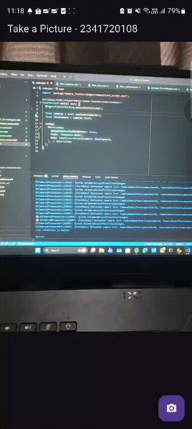

# Pemrograman Mobile

Nama : Saka Nabil

NIM : 2341720108

Kelas : TI-3G

# Kamera - Week 09

## Praktikum 1: Mengambil Foto dengan Kamera di Flutter

### Pada praktikum ini saya membuat aplikasi untuk mengambil gambar menggunakan plugin kamera yang sudah tersedia di flutter.

## Hasil Praktikum 1

## Praktikum 2: Membuat photo filter carousel

### Pada praktikum ini saya menggabungkan dari praktikum 1 yang digunakan untuk mengambil foto, kemudian bisa menambahkan filter pada foto yang sudah diambil menggunakan filter carousel.

## Hasil Praktikum 2

# Tugas Praktikum

## 1. Selesaikan Praktikum 1 dan 2, lalu dokumentasikan dan push ke repository Anda berupa screenshot setiap hasil pekerjaan beserta penjelasannya di file README.md! Jika terdapat error atau kode yang tidak dapat berjalan, silakan Anda perbaiki sesuai tujuan aplikasi dibuat!

    Done.

## 2. Gabungkan hasil praktikum 1 dengan hasil praktikum 2 sehingga setelah melakukan pengambilan foto, dapat dibuat filter carouselnya!

    Done.

## 3. Jelaskan maksud void async pada praktikum 1?

### Jawab : `void main() async` berarti fungsi `main()` berjalan secara **asinkron**, sehingga dapat menjalankan operasi yang membutuhkan waktu (seperti `await availableCameras()`) tanpa menghentikan eksekusi program utama.

## 4. Jelaskan fungsi dari anotasi @immutable dan @override ?

### Jawab : `@immutable` menandakan bahwa semua properti dalam kelas tidak boleh diubah setelah objek dibuat. `@override` digunakan untuk menandai bahwa suatu metode menimpa (mengganti) implementasi metode dari kelas induknya.

## 5. Kumpulkan link commit repository GitHub Anda kepada dosen yang telah disepakati!

    Done.
