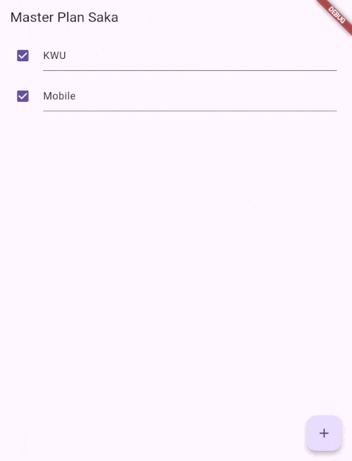
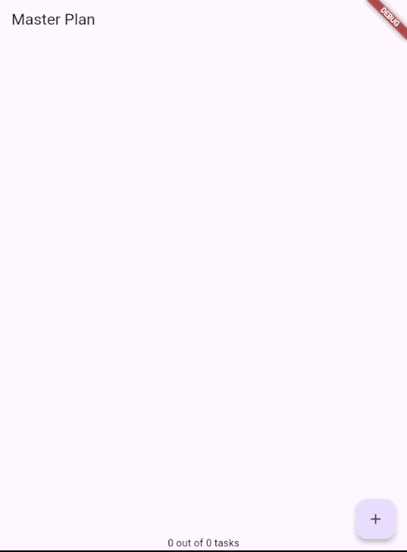
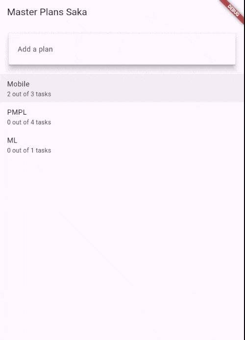
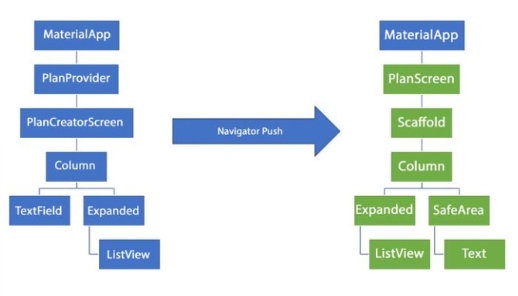

# Pemrograman Mobile

Nama : Saka Nabil

NIM : 2341720108

Kelas : TI-3G

# Dasar State Management - Week 10

# Praktikum 1: Dasar State dengan Model-View

## Langkah 1: Buat Project Baru

### Buatlah sebuah project flutter baru dengan nama master_plan di folder src week-10 repository GitHub Anda atau sesuai style laporan praktikum yang telah disepakati. Lalu buatlah susunan folder dalam project seperti gambar berikut ini.

## Langkah 2: Membuat model task.dart

### Praktik terbaik untuk memulai adalah pada lapisan data (data layer). Ini akan memberi Anda gambaran yang jelas tentang aplikasi Anda, tanpa masuk ke detail antarmuka pengguna Anda. Di folder model, buat file bernama task.dart dan buat class Task. Class ini memiliki atribut description dengan tipe data String dan complete dengan tipe data Boolean, serta ada konstruktor. Kelas ini akan menyimpan data tugas untuk aplikasi kita. Tambahkan kode berikut:

```dart
    class Task {
  final String description;
  final bool complete;

  const Task({
    this.complete = false,
    this.description = '',
  });
}
```

## Langkah 3: Buat file plan.dart

### Kita juga perlu sebuah List untuk menyimpan daftar rencana dalam aplikasi to-do ini. Buat file plan.dart di dalam folder models dan isi kode seperti berikut.

```dart
import './task.dart';

class Plan {
  final String name;
  final List<Task> tasks;

  const Plan({this.name = '', this.tasks = const []});
}
```

## Langkah 4: Buat file data_layer.dart

### Kita dapat membungkus beberapa data layer ke dalam sebuah file yang nanti akan mengekspor kedua model tersebut. Dengan begitu, proses impor akan lebih ringkas seiring berkembangnya aplikasi. Buat file bernama data_layer.dart di folder models. Kodenya hanya berisi export seperti berikut.

```dart
export 'plan.dart';
export 'task.dart';
```

## Langkah 5: Pindah ke file main.dart

### Ubah isi kode main.dart sebagai berikut.

```dart
import 'package:flutter/material.dart';
import './views/plan_screen.dart';

void main() => runApp(MasterPlanApp());

class MasterPlanApp extends StatelessWidget {
  const MasterPlanApp({super.key});

  @override
  Widget build(BuildContext context) {
    return MaterialApp(
     theme: ThemeData(primarySwatch: Colors.purple),
     home: PlanScreen(),
    );
  }
}
```

## Langkah 6: buat plan_screen.dart

```dart
import '../models/data_layer.dart';
import 'package:flutter/material.dart';

class PlanScreen extends StatefulWidget {
  const PlanScreen({super.key});

  @override
  State createState() => _PlanScreenState();
}

class _PlanScreenState extends State<PlanScreen> {
  Plan plan = const Plan();

  @override
  Widget build(BuildContext context) {
   return Scaffold(
    // ganti ‘Namaku' dengan Nama panggilan Anda
    appBar: AppBar(title: const Text('Master Plan Namaku')),
    body: _buildList(),
    floatingActionButton: _buildAddTaskButton(),
   );
  }
}
```

## Langkah 7: buat method \_buildAddTaskButton()

```dart
Widget _buildAddTaskButton() {
  return FloatingActionButton(
   child: const Icon(Icons.add),
   onPressed: () {
     setState(() {
      plan = Plan(
       name: plan.name,
       tasks: List<Task>.from(plan.tasks)
       ..add(const Task()),
     );
    });
   },
  );
}
```

## Langkah 8: buat widget \_buildList()

```dart
Widget _buildList() {
  return ListView.builder(
   itemCount: plan.tasks.length,
   itemBuilder: (context, index) =>
   _buildTaskTile(plan.tasks[index], index),
  );
}
```

## Langkah 9: buat widget \_buildTaskTile

```dart
 Widget _buildTaskTile(Task task, int index) {
    return ListTile(
      leading: Checkbox(
          value: task.complete,
          onChanged: (selected) {
            setState(() {
              plan = Plan(
                name: plan.name,
                tasks: List<Task>.from(plan.tasks)
                  ..[index] = Task(
                    description: task.description,
                    complete: selected ?? false,
                  ),
              );
            });
          }),
      title: TextFormField(
        initialValue: task.description,
        onChanged: (text) {
          setState(() {
            plan = Plan(
              name: plan.name,
              tasks: List<Task>.from(plan.tasks)
                ..[index] = Task(
                  description: text,
                  complete: task.complete,
                ),
            );
          });
        },
      ),
    );
  }
```

## Langkah 10: Tambah Scroll Controller

```dart
late ScrollController scrollController;
```

## Langkah 11: Tambah Scroll Listener

```dart
@override
void initState() {
  super.initState();
  scrollController = ScrollController()
    ..addListener(() {
      FocusScope.of(context).requestFocus(FocusNode());
    });
}
```

## Langkah 12: Tambah controller dan keyboard behavior

```dart
return ListView.builder(
  controller: scrollController,
 keyboardDismissBehavior: Theme.of(context).platform ==
 TargetPlatform.iOS
          ? ScrollViewKeyboardDismissBehavior.onDrag
          : ScrollViewKeyboardDismissBehavior.manual,
```

## Langkah 13: Terakhir, tambah method dispose()

```dart
@override
void dispose() {
  scrollController.dispose();
  super.dispose();
}
```

## Langkah 14: Hasil



# Tugas Praktikum 1: Dasar State dengan Model-View

## 1. Selesaikan langkah-langkah praktikum tersebut, lalu dokumentasikan berupa GIF hasil akhir praktikum beserta penjelasannya di file README.md! Jika Anda menemukan ada yang error atau tidak berjalan dengan baik, silakan diperbaiki.

    Done.

## 2. Jelaskan maksud dari langkah 4 pada praktikum tersebut! Mengapa dilakukan demikian?

### Jawab : Langkah 4 dilakukan agar kedua model (`plan.dart` dan `task.dart`) dapat diimpor sekaligus melalui satu file (`data_layer.dart`), sehingga mempermudah dan merapikan proses impor di seluruh aplikasi.

## 3. Mengapa perlu variabel plan di langkah 6 pada praktikum tersebut? Mengapa dibuat konstanta ?

### Jawab : Variabel `plan` dibuat sebagai konstanta agar data rencana (`Plan`) memiliki nilai tetap dan tidak berubah selama runtime, sekaligus menjadi sumber data utama yang digunakan untuk menampilkan daftar tugas pada tampilan `PlanScreen`.

## 4. Lakukan capture hasil dari Langkah 9 berupa GIF, kemudian jelaskan apa yang telah Anda buat!


### Jawab : Saya telah membuat aplikasi master plan, dimana saya bisa menambahkan plan dan memberi checklist jika plan tersebut sudah saya lakukan.

## 5. Apa kegunaan method pada Langkah 11 dan 13 dalam lifecyle state ?

### Jawab : Method pada Langkah 11 (`initState()`) digunakan untuk inisialisasi dan menyiapkan listener saat widget pertama kali dibuat, sedangkan Langkah 13 (`dispose()`) digunakan untuk membersihkan dan melepaskan resource seperti controller ketika widget dihapus dari widget tree.

## 6. Kumpulkan laporan praktikum Anda berupa link repository GitHub kepada dosen!

    Done.

# Praktikum 2: Mengelola Data Layer dengan InheritedWidget dan InheritedNotifie

## Langkah 1: Buat file plan_provider.dart

```dart
import 'package:flutter/material.dart';
import '../models/data_layer.dart';

class PlanProvider extends InheritedNotifier<ValueNotifier<Plan>> {
  const PlanProvider({super.key, required Widget child, required
   ValueNotifier<Plan> notifier})
  : super(child: child, notifier: notifier);

  static ValueNotifier<Plan> of(BuildContext context) {
   return context.
    dependOnInheritedWidgetOfExactType<PlanProvider>()!.notifier!;
  }
}
```

## Langkah 2: Edit main.dart

```dart
return MaterialApp(
  theme: ThemeData(primarySwatch: Colors.purple),
  home: PlanProvider(
    notifier: ValueNotifier<Plan>(const Plan()),
    child: const PlanScreen(),
   ),
);
```

## Langkah 3: Tambah method pada model plan.dart

```dart
int get completedCount => tasks
  .where((task) => task.complete)
  .length;

String get completenessMessage =>
  '$completedCount out of ${tasks.length} tasks';
```

## Langkah 4: Pindah ke PlanScreen

### Edit PlanScreen agar menggunakan data dari PlanProvider. Hapus deklarasi variabel plan (ini akan membuat error). Kita akan perbaiki pada langkah 5 berikut ini.

## Langkah 5: Edit method \_buildAddTaskButton

```dart
Widget _buildAddTaskButton(BuildContext context) {
  ValueNotifier<Plan> planNotifier = PlanProvider.of(context);
  return FloatingActionButton(
    child: const Icon(Icons.add),
    onPressed: () {
      Plan currentPlan = planNotifier.value;
      planNotifier.value = Plan(
        name: currentPlan.name,
        tasks: List<Task>.from(currentPlan.tasks)..add(const Task()),
      );
    },
  );
}
```

## Langkah 6: Edit method \_buildTaskTile

```dart
Widget _buildTaskTile(Task task, int index, BuildContext context) {
  ValueNotifier<Plan> planNotifier = PlanProvider.of(context);
  return ListTile(
    leading: Checkbox(
       value: task.complete,
       onChanged: (selected) {
         Plan currentPlan = planNotifier.value;
         planNotifier.value = Plan(
           name: currentPlan.name,
           tasks: List<Task>.from(currentPlan.tasks)
             ..[index] = Task(
               description: task.description,
               complete: selected ?? false,
             ),
         );
       }),
    title: TextFormField(
      initialValue: task.description,
      onChanged: (text) {
        Plan currentPlan = planNotifier.value;
        planNotifier.value = Plan(
          name: currentPlan.name,
          tasks: List<Task>.from(currentPlan.tasks)
            ..[index] = Task(
              description: text,
              complete: task.complete,
            ),
        );
      },
    ),
  );
}
```

## Langkah 7: Edit \_buildList

```dart
Widget _buildList(Plan plan) {
   return ListView.builder(
     controller: scrollController,
     itemCount: plan.tasks.length,
     itemBuilder: (context, index) =>
        _buildTaskTile(plan.tasks[index], index, context),
   );
}
```

## Langkah 8: Tetap di class PlanScreen

### Edit method build sehingga bisa tampil progress pada bagian bawah (footer). Caranya, bungkus (wrap) \_buildList dengan widget Expanded dan masukkan ke dalam widget Column seperti kode pada Langkah 9.

## Langkah 9: Tambah widget SafeArea

```dart
@override
Widget build(BuildContext context) {
   return Scaffold(
     appBar: AppBar(title: const Text('Master Plan')),
     body: ValueListenableBuilder<Plan>(
       valueListenable: PlanProvider.of(context),
       builder: (context, plan, child) {
         return Column(
           children: [
             Expanded(child: _buildList(plan)),
             SafeArea(child: Text(plan.completenessMessage))
           ],
         );
       },
     ),
     floatingActionButton: _buildAddTaskButton(context),
   );
}
```

## Langkah 10: Hasil



# Tugas Praktikum 2: InheritedWidget

## 1. Selesaikan langkah-langkah praktikum tersebut, lalu dokumentasikan berupa GIF hasil akhir praktikum beserta penjelasannya di file README.md! Jika Anda menemukan ada yang error atau tidak berjalan dengan baik, silakan diperbaiki sesuai dengan tujuan aplikasi tersebut dibuat.

    Done.

## 2. Jelaskan mana yang dimaksud InheritedWidget pada langkah 1 tersebut! Mengapa yang digunakan InheritedNotifier?

### Jawab : `InheritedWidget` pada langkah tersebut adalah kelas dasar yang memungkinkan data dibagikan ke seluruh widget turunannya, dan digunakan `InheritedNotifier` karena mendukung pembaruan otomatis pada widget turunan saat nilai `ValueNotifier<Plan>` berubah.

## 3. Jelaskan maksud dari method di langkah 3 pada praktikum tersebut! Mengapa dilakukan demikian?

### Jawab : Kedua method tersebut digunakan untuk menghitung jumlah tugas yang sudah selesai (`completedCount`) dan menampilkan pesan progres penyelesaian (`completenessMessage`), sehingga memudahkan pemantauan status pekerjaan dalam rencana (`Plan`).

## 4. Lakukan capture hasil dari Langkah 9 berupa GIF, kemudian jelaskan apa yang telah Anda buat!


### Jawab : Pada aplikasi master plan saya, saya menambahkan counter dimana jumlah task akan muncul serta sudah berapa yang diselesaikan.

## 5. Kumpulkan laporan praktikum Anda berupa link commit atau repository GitHub ke dosen yang telah disepakati !

    Done.

# Praktikum 3: Membuat State di Multiple Screens

## Langkah 1: Edit PlanProvider

```dart
class PlanProvider extends
InheritedNotifier<ValueNotifier<List<Plan>>> {
  const PlanProvider({super.key, required Widget child, required
ValueNotifier<List<Plan>> notifier})
     : super(child: child, notifier: notifier);

  static ValueNotifier<List<Plan>> of(BuildContext context) {
    return context.
dependOnInheritedWidgetOfExactType<PlanProvider>()!.notifier!;
  }
}
```

## Langkah 2: Edit main.dart

```dart
@override
Widget build(BuildContext context) {
  return PlanProvider(
    notifier: ValueNotifier<List<Plan>>(const []),
    child: MaterialApp(
      title: 'State management app',
      theme: ThemeData(
        primarySwatch: Colors.blue,
      ),
      home: const PlanScreen(),
    ),
  );
}
```

## Langkah 3: Edit plan_screen.dart

```dart
final Plan plan;
const PlanScreen({super.key, required this.plan});
```

## Langkah 4: Error

### Itu akan terjadi error setiap kali memanggil PlanProvider.of(context). Itu terjadi karena screen saat ini hanya menerima tugas-tugas untuk satu kelompok Plan, tapi sekarang PlanProvider menjadi list dari objek plan tersebut.

## Langkah 5: Tambah getter Plan

```dart
class _PlanScreenState extends State<PlanScreen> {
  late ScrollController scrollController;
  Plan get plan => widget.plan;
```

## Langkah 6: Method initState()

```dart
@override
void initState() {
   super.initState();
   scrollController = ScrollController()
    ..addListener(() {
      FocusScope.of(context).requestFocus(FocusNode());
    });
}
```

## Langkah 7: Widget build

```dart
 @override
  Widget build(BuildContext context) {
    ValueNotifier<List<Plan>> plansNotifier = PlanProvider.of(context);

    return Scaffold(
      appBar: AppBar(title: Text(_plan.name)),
      body: ValueListenableBuilder<List<Plan>>(
        valueListenable: plansNotifier,
        builder: (context, plans, child) {
          Plan currentPlan = plans.firstWhere((p) => p.name == plan.
name);
          return Column(
            children: [
              Expanded(child: _buildList(currentPlan)),
              SafeArea(child: Text(currentPlan.
completenessMessage)),
            ],);},),
      floatingActionButton: _buildAddTaskButton(context,)
  ,);
 }

  Widget _buildAddTaskButton(BuildContext context) {
    ValueNotifier<List<Plan>> planNotifier = PlanProvider.
of(context);
    return FloatingActionButton(
      child: const Icon(Icons.add),
      onPressed: () {
        Plan currentPlan = plan;
        int planIndex =
            planNotifier.value.indexWhere((p) => p.name == currentPlan.name);
        List<Task> updatedTasks = List<Task>.from(currentPlan.tasks)
          ..add(const Task());
        planNotifier.value = List<Plan>.from(planNotifier.value)
          ..[planIndex] = Plan(
            name: currentPlan.name,
            tasks: updatedTasks,
          );
        plan = Plan(
          name: currentPlan.name,
          tasks: updatedTasks,
        );},);
  }
```

## Langkah 8: Edit \_buildTaskTile

```dart
  Widget _buildTaskTile(Task task, int index, BuildContext context)
{
    ValueNotifier<List<Plan>> planNotifier = PlanProvider.
of(context);

    return ListTile(
      leading: Checkbox(
         value: task.complete,
         onChanged: (selected) {
           Plan currentPlan = plan;
           int planIndex = planNotifier.value
              .indexWhere((p) => p.name == currentPlan.name);
           planNotifier.value = List<Plan>.from(planNotifier.value)
             ..[planIndex] = Plan(
               name: currentPlan.name,
               tasks: List<Task>.from(currentPlan.tasks)
                 ..[index] = Task(
                   description: task.description,
                   complete: selected ?? false,
                 ),);
         }),
      title: TextFormField(
        initialValue: task.description,
        onChanged: (text) {
          Plan currentPlan = plan;
          int planIndex =
             planNotifier.value.indexWhere((p) => p.name ==
currentPlan.name);
          planNotifier.value = List<Plan>.from(planNotifier.value)
            ..[planIndex] = Plan(
              name: currentPlan.name,
              tasks: List<Task>.from(currentPlan.tasks)
                ..[index] = Task(
                  description: text,
                  complete: task.complete,
                ),
            );
},),);}
```

## Langkah 9: Buat screen baru

```dart
home: const PlanCreatorScreen(),
```

## Langkah 10: Pindah ke class \_PlanCreatorScreenState

```dart
final textController = TextEditingController();

@override
void dispose() {
  textController.dispose();
  super.dispose();
}
```

## Langkah 11: Pindah ke method build

```dart
@override
Widget build(BuildContext context) {
  return Scaffold(
    // ganti ‘Namaku' dengan nama panggilan Anda
    appBar: AppBar(title: const Text('Master Plans Namaku')),
    body: Column(children: [
      _buildListCreator(),
      Expanded(child: _buildMasterPlans())
    ]),
  );
}
```

## Langkah 12: Buat widget \_buildListCreator

```dart
Widget _buildListCreator() {
  return Padding(
     padding: const EdgeInsets.all(20.0),
     child: Material(
       color: Theme.of(context).cardColor,
       elevation: 10,
       child: TextField(
          controller: textController,
          decoration: const InputDecoration(
             labelText: 'Add a plan',
             contentPadding: EdgeInsets.all(20)),
          onEditingComplete: addPlan),
     ));
}
```

## Langkah 13: Buat void addPlan()

```dart
void addPlan() {
  final text = textController.text;
    if (text.isEmpty) {
      return;
    }
    final plan = Plan(name: text, tasks: []);
    ValueNotifier<List<Plan>> planNotifier =
PlanProvider.of(context);
    planNotifier.value = List<Plan>.from(planNotifier.value)..
add(plan);
    textController.clear();
    FocusScope.of(context).requestFocus(FocusNode());
    setState(() {});
}
```

## Langkah 14: Buat widget \_buildMasterPlans()

```dart
Widget _buildMasterPlans() {
  ValueNotifier<List<Plan>> planNotifier = PlanProvider.of(context);
    List<Plan> plans = planNotifier.value;

    if (plans.isEmpty) {
      return Column(
         mainAxisAlignment: MainAxisAlignment.center,
         children: <Widget>[
           const Icon(Icons.note, size: 100, color: Colors.grey),
           Text('Anda belum memiliki rencana apapun.',
              style: Theme.of(context).textTheme.headlineSmall)
         ]);
    }
    return ListView.builder(
        itemCount: plans.length,
        itemBuilder: (context, index) {
          final plan = plans[index];
          return ListTile(
              title: Text(plan.name),
              subtitle: Text(plan.completenessMessage),
              onTap: () {
                Navigator.of(context).push(
                   MaterialPageRoute(builder: (_) =>
PlanScreen(plan: plan,)));
              });
        });
}
```

## Langkah 15: Hasil



# Tugas Praktikum 3: State di Multiple Screens

## 1. Selesaikan langkah-langkah praktikum tersebut, lalu dokumentasikan berupa GIF hasil akhir praktikum beserta penjelasannya di file README.md! Jika Anda menemukan ada yang error atau tidak berjalan dengan baik, silakan diperbaiki sesuai dengan tujuan aplikasi tersebut dibuat.

    Done.

## 2. Berdasarkan Praktikum 3 yang telah Anda lakukan, jelaskan maksud dari gambar diagram berikut ini!



### Jawab : Gambar diagram tersebut menunjukkan **perpindahan (navigasi)** antar halaman pada aplikasi Flutter menggunakan **`Navigator.push`**, di mana aplikasi berpindah dari struktur widget **`PlanCreatorScreen`** (kiri) ke **`PlanScreen`** (kanan). Diagram ini menggambarkan bagaimana **`Navigator.push`** menambahkan layar baru (`PlanScreen`) di atas layar sebelumnya (`PlanCreatorScreen`) pada tumpukan (stack) navigasi, sehingga pengguna dapat berpindah antar halaman tanpa kehilangan konteks aplikasi.

## 3. Lakukan capture hasil dari Langkah 14 berupa GIF, kemudian jelaskan apa yang telah Anda buat!


### Jawab : Saya menambahkan screen baru yang dimana menjadi screen utama baru yang kemudian didalamnya terdapat kumpulan task task dengan screen berbeda.

## 4. Kumpulkan laporan praktikum Anda berupa link commit atau repository GitHub ke dosen yang telah disepakati

    Done.
