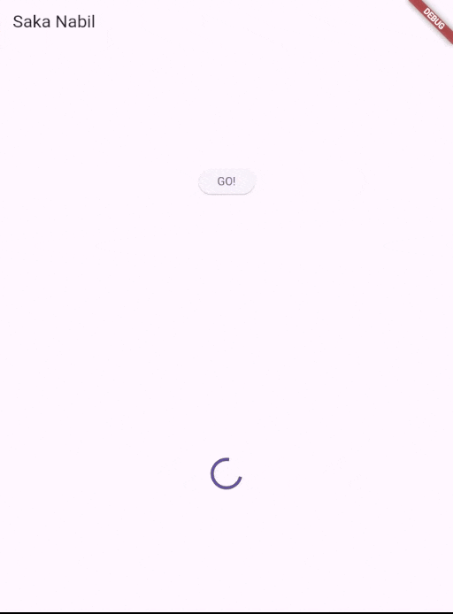
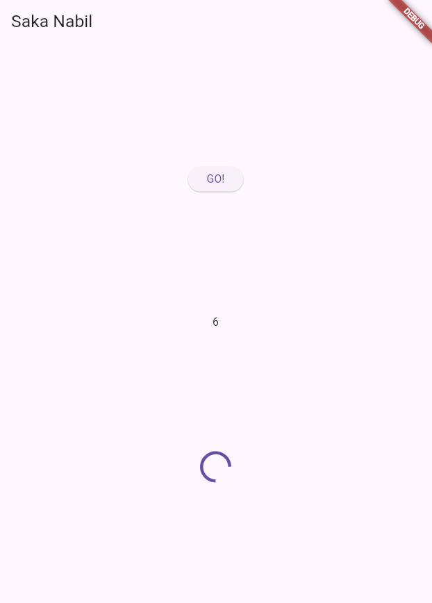
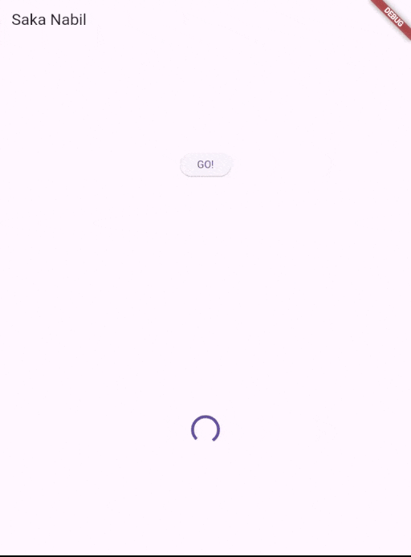
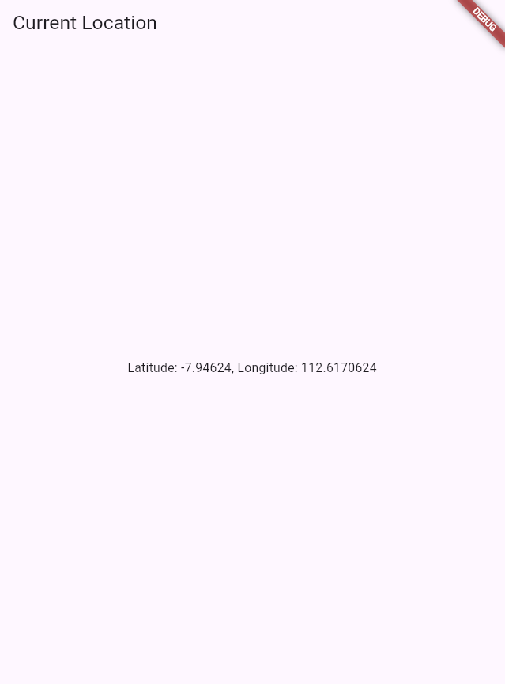
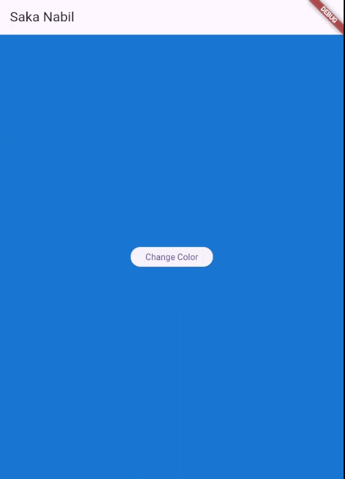

# Pemrograman Mobile

Nama : Saka Nabil

NIM : 2341720108

Kelas : TI-3G

# Pemrograman Asynchronous - Week 11

# Praktikum 1: Mengunduh Data dari Web Service (API)

## Hasil dari Praktikum 1

# Praktikum 2: Menggunakan await/async untuk menghindari callbacks

## Hasil dari Praktikum 2

# Praktikum 3: Menggunakan Completer di Future

## Hasil dari Praktikum 3

# Praktikum 4: Memanggil Future secara paralel

# Praktikum 5: Menangani Respon Error pada Async Code

## Hasil dari Praktikum 5

# Praktikum 6: Menggunakan Future dengan StatefulWidget

## Hasil dari Praktikum 6

# Praktikum 7: Manajemen Future dengan FutureBuilder

## Hasil dari Praktikum 7

# Praktikum 8: Navigation route dengan Future Function

## Hasil dari Praktikum 8

# Praktikum 9: Memanfaatkan async/await dengan Widget Dialog

## Hasil dari Praktikum 9

