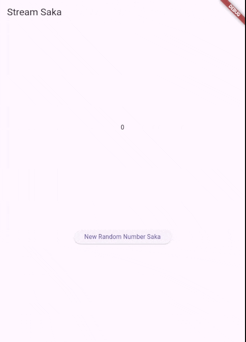
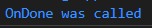

# Pemrograman Mobile

Nama : Saka Nabil

NIM : 2341720108

Kelas : TI-3G

# Lanjutan State Management dengan Streams - Week 12

# Praktikum 1: Dart Streams

## Soal 3

### Jelaskan fungsi keyword yield\* pada kode tersebut!

### Jawab : fungsi keyword 'yield\*' digunakan untuk meneruskan nilai-nilai dari stream yang dihasilkan oleh Stream.periodic.

## Soal 5

### Jelaskan perbedaan menggunakan listen dan await for (langkah 9) !

### Jawab : perbedaan await for dan listen adalah await for akan menunggu setiap event selesai diproses sebelum melanjutkan ke event berikutnya, sedangkan listen akan memproses setiap event secara asinkron tanpa menunggu event.

## Hasil dari Praktikum 1

# Praktikum 2: Stream controllers dan sinks

## Soal 6

### Jelaskan maksud kode langkah 8 dan 10 tersebut!

### Jawab : Langkah 8: Kode ini menginisialisasi stream controller dan "berlangganan" (listen) ke stream tersebut, di mana setiap data baru yang masuk akan memicu pembaruan UI (setState) untuk menampilkan data itu.

### Langkah 10: Kode ini berfungsi untuk menghasilkan sebuah angka acak baru (antara 0 hingga 9) dan langsung memasukkannya ke dalam sink (input) stream untuk diproses.

## Soal 7

### Jelaskan maksud kode langkah 13 sampai 15 tersebut!

### Langkah 13: Membuat Pemicu Error. Membuat sebuah fungsi baru bernama addError(). Tugas fungsi ini adalah memasukkan (inject) sebuah data error (dalam hal ini, string 'error') secara manual ke dalam stream. Ini adalah cara untuk "sengaja" membuat stream mengalami kondisi error untuk keperluan pengujian.

### Langkah 14: Membuat Penangkap Error. Menambahkan blok .onError() pada stream.listen(). Ini adalah penangkap error.

### Langkah 15: Menggunakan Pemicu Error. Mengubah apa yang dilakukan oleh fungsi addRandomNumber(). Fungsi ini terhubung dengan tombol 'New Random Number'

## Hasil dari Praktikum 2

# Praktikum 3: Injeksi data ke streams

## Soal 8

### Jelaskan maksud kode langkah 1-3 tersebut!

### Langkah 1: Mendeklarasikan Variabel Transformer. Membuat sebuah "wadah" (variabel) bernama transformer. Ini akan diisi dengan logika untuk mengubah stream.

### Langkah 2: Menentukan Logika Transformer. mendefinisikan cara kerja

### Langkah 3: Menerapkan Transformer. Mengubah cara Anda "mendengarkan" stream.

## Hasil dari Praktikum 3

# Praktikum 4: Subscribe ke stream events

## Soal 9

### Jelaskan maksud kode langkah 2, 6 dan 8 tersebut!

### Langkah 2: Langkah ini menginisialisasi stream dan memulai "langganan" (subscription) untuk mendengarkan data dari stream, di mana setiap data yang masuk akan langsung memperbarui tampilan UI.

### Langkah 6: Langkah ini memastikan langganan stream (subscription) dibatalkan secara bersih saat widget tidak lagi digunakan (dispose) untuk mencegah kebocoran memori.

### Langkah 8: Langkah ini berfungsi untuk menambahkan angka acak ke stream hanya jika stream masih terbuka, namun jika stream sudah ditutup, ia akan mengatur tampilan angka menjadi -1.

## Hasil dari Praktikum 4

# Praktikum 5: Multiple stream subscriptions

## Soal 10

### Jelaskan mengapa error itu bisa terjadi ?

### Error ini terjadi karena Anda mencoba mendengarkan (memanggil .listen()) pada sebuah stream yang sudah memiliki pendengar lain, padahal stream tersebut hanya mengizinkan satu pendengar saja.

## Hasil dari Praktikum 5

## Soal 11

### Jelaskan mengapa hal itu bisa terjadi ?

### Jawab : Hal itu bisa terjadi karena karena terdapat 2 langganan (subscription) yang mendengarkan stream yang sama.

# Praktikum 6: StreamBuilder

## Soal 12

### Jelaskan maksud kode pada langkah 3 dan 7 !

### Jawab : Langkah 3: Kode ini membuat sebuah generator stream yang secara terus-menerus menghasilkan angka acak baru setiap satu detik.

### Langkah 7: Kode ini menggunakan StreamBuilder untuk secara otomatis mendengarkan stream dan membangun ulang UI untuk menampilkan angka terbaru yang diterima dari stream tersebut.

## Hasil dari Praktikum 6

# Praktikum 7: BLoC Pattern

## Soal 13

### Jelaskan maksud praktikum ini ! Dimanakah letak konsep pola BLoC-nya ?

### Jawab : Praktikum ini mendemonstrasikan cara memisahkan logika bisnis dari UI (pola BLoC) dengan menggunakan kelas RandomNumberBloc, yang menerima event melalui sink generateRandom dan mengeluarkan state baru (angka acak) melalui stream randomNumber.

## Hasil dari Praktikum 7

