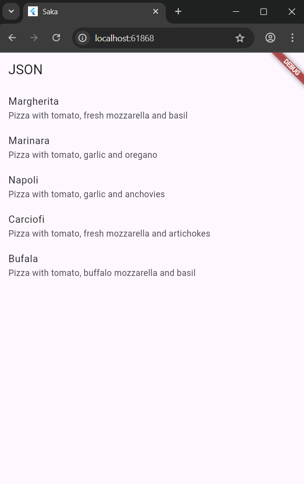
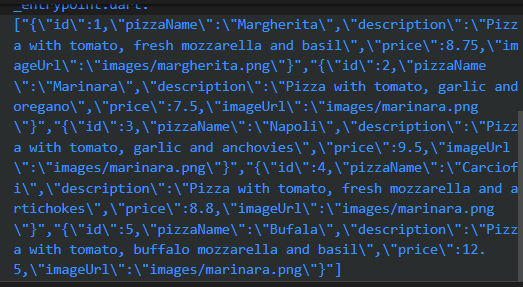
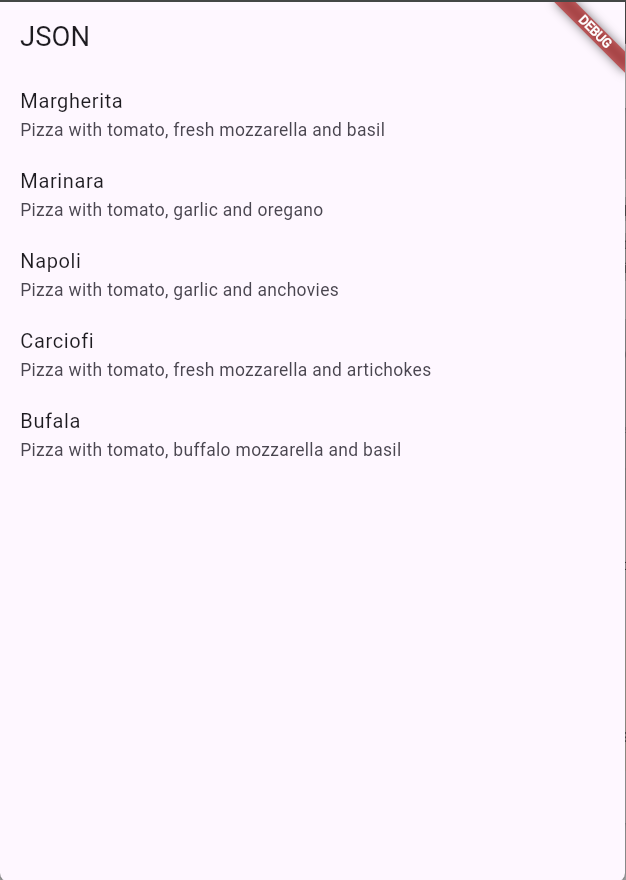
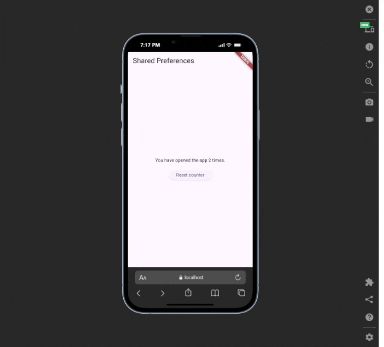
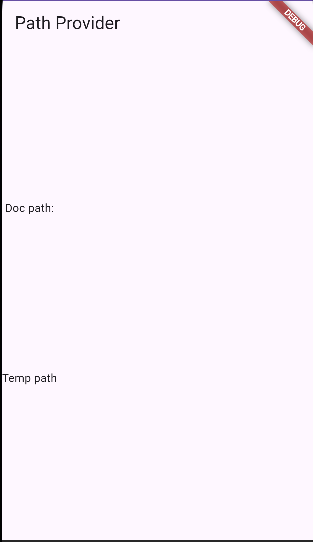
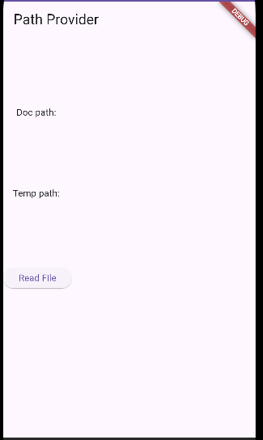

# Pemrograman Mobile

Nama : Saka Nabil

NIM : 2341720108

Kelas : TI-3G

# Persistensi Data - Week 13

# Praktikum 1: Konversi Dart model ke JSON

## Hasil dari Praktikum 1

# Praktikum 2: Handle kompatibilitas data JSON

## Soal 6

## Hasil dari Praktikum 2

# Praktikum 3: Menangani error JSON

## Soal 5

### Jelaskan maksud kode lebih safe dan maintainable!

### Jawab: Maksud dari kode yang dibuat lebih safe dan maintainable adalah bahwa kode tersebut telah dirancang dengan mempertimbangkan penanganan kesalahan yang kuat dan struktur yang jelas, sehingga mengurangi risiko bug dan mempermudah pengembang lain (atau diri Anda di masa depan) untuk memahami, memodifikasi, dan memeliharanya.

## Hasil dari Praktikum 3

# Praktikum 4: SharedPreferences

## Hasil dari Praktikum 4

# Praktikum 5: Akses filesystem dengan path_provider

## Hasil dari Praktikum 5

# Praktikum 6: Akses filesystem dengan direktori

## Soal 8

### Jelaskan maksud kode pada langkah 3 dan 7 !

### Jawab : Langkah 3: Membuat Method writeFile() Kode ini adalah fungsi asinkron yang bertugas menuliskan string data (Nama dan NIM Anda) ke dalam file yang telah ditentukan jalurnya (myFile) di penyimpanan dokumen aplikasi.

### Langkah 7: Run Langkah ini menguji fungsionalitas aplikasi secara keseluruhan, memastikan bahwa tombol yang baru ditambahkan dapat menjalankan fungsi readFile() untuk mengambil dan menampilkan konten teks yang sebelumnya sudah disimpan ke dalam file.

## Hasil dari Praktikum 6

# Praktikum 7: Menyimpan data dengan enkripsi/dekripsi

## Hasil dari Praktikum 7

