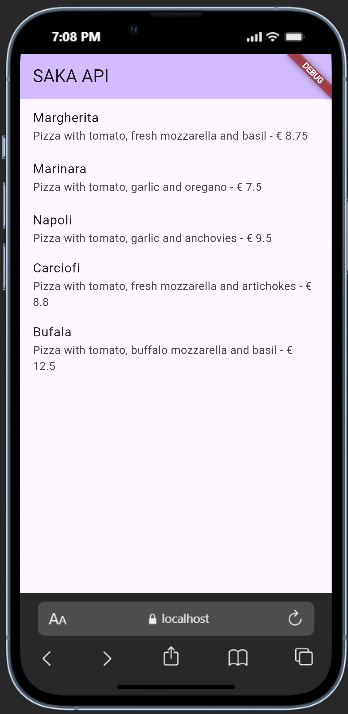
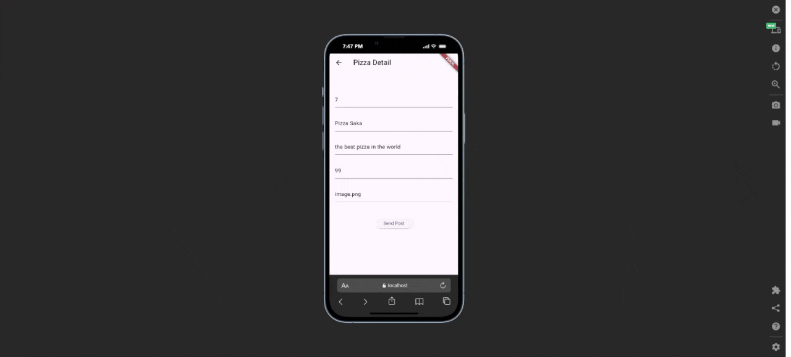
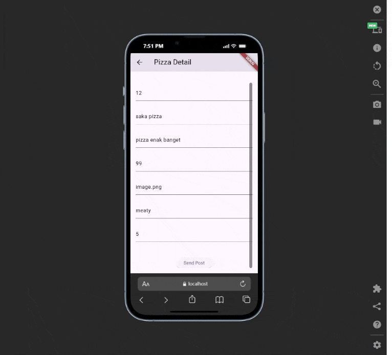
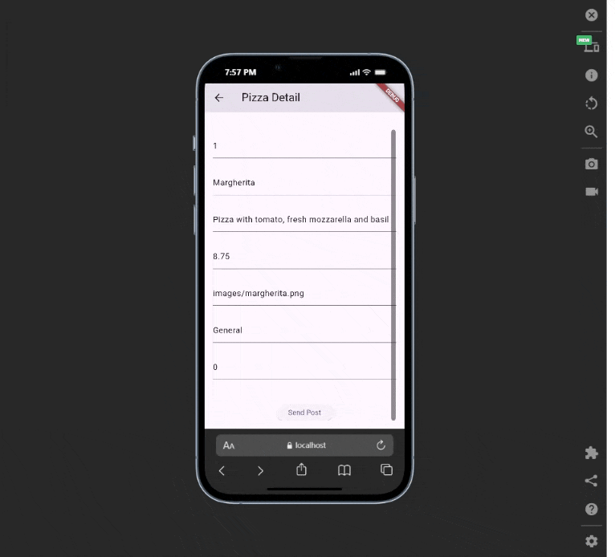

# Pemrograman Mobile

Nama : Saka Nabil

NIM : 2341720108

Kelas : TI-3G

# RESTful API - Week 14

# Praktikum 1: Membuat layanan Mock API

## Hasil dari Praktikum 1

# Praktikum 2: Mengirim Data ke Web Service (POST)

## Hasil dari Praktikum 2

## Hasil dari Praktikum 2 Soal 2

# Praktikum 3: Memperbarui Data di Web Service (PUT)

## Hasil dari Praktikum 3

# Praktikum 4: Menghapus Data dari Web Service (DELETE)

## Hasil dari Praktikum 4

